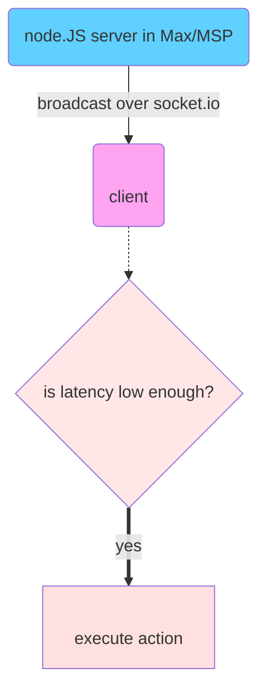

# rqlive-server
A low-latency, synchronized server for stage/crowd interactions. MAX-MSP embeddable

## Function A: Broadcasting actions over socket.io
---
"action broadcast"
---

## Function B: endpoint registration
